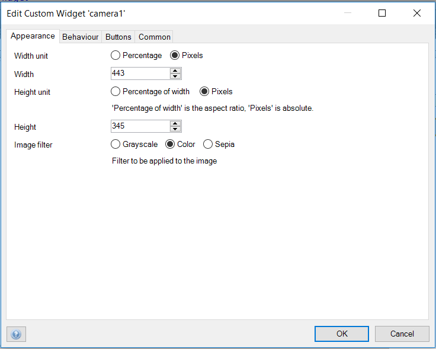
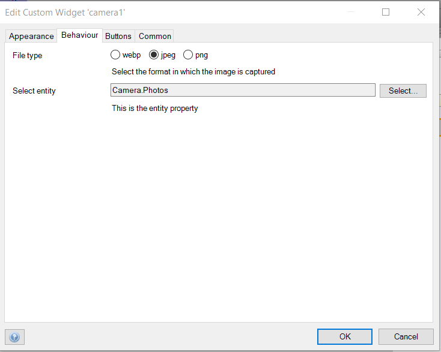
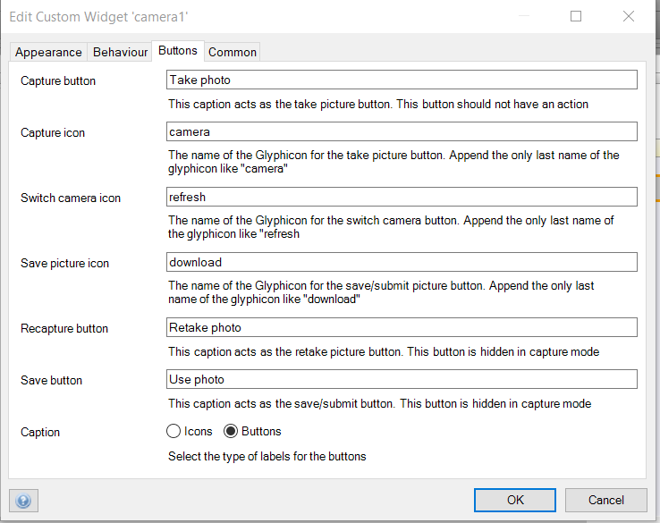

# Camera
Allows users to take and save pictures on their mendix applications

## Features
* Supports webp, jpeg and png image file formats
* Set capturing window dimensions
* Take pictures and store them
* Detect presence of multi camera devices
* Swap between the different camera devices

## Dependencies
Mendix 7.11

## Demo project
https://cameratest100.mxapps.io/

## Usage
The widget requires a context and should be configured as shown below
 ### Appearance
 
  #### Width unit
    The unit to be applied to the width of the capturing window.
 #### Width
    The value of the width property of the capturing window.
 #### Height unit
    The unit to be applied to the height of the capturing window.
 #### Height
    The value of the height property of the capturing window.
 #### Image Filter
    The filter type to applied to the capturing window of the web cam.
### Behaviour
 
 #### Select Entity type
    An entity that inherits/generalized from system.images is selected.
 #### File type
    The file format of image/photo that is taken and stored.
### Buttons
 
 #### Capture button
    This caption acts as the take picture button. This button should not have an action.
 #### Recapture button
    This caption acts as the retake picture button. This button is hidden in capture mode.
 #### Save button
    This caption acts as the save/submit button. This button is hidden in capture mode.
 #### Capture icon
    The name of the Glyphicon for the take picture button. Append the only last name of the glyphicon like "camera".
 #### Use picture icon
    The name of the Glyphicon for the save/submit picture button. Append the only last name of the glyphicon like "download".
 #### Switch camera icon
    The name of the Glyphicon for the switch camera button. Append the only last name of the glyphicon like "refresh.
 #### Caption
    The type of labels for the buttons.

## Issues, suggestions and feature requests
Please report issues at https://github.com/FlockOfBirds/camera/issues

## Development and contribution
Please follow [development guide](/development.md)
